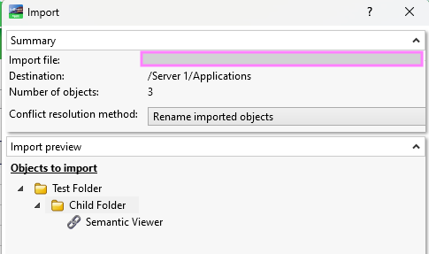
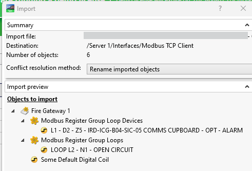

# ebo-app-factory

[](https://github.com/clivegross/ebo-app-factory/actions/workflows/build.yml)

---

## Table of Contents

- [Installation](#installation)
- [Overview](#overview)
- [Build from template- Basic usage](#basic-usage)
- [Build from template- Multiple templates](#advanced-usage)
- [Building from scratch](#building-from-scratch-programmatically)
- [Build Schedules](#eboschedulebuilder-usage)
- [Build Modbus stuff](#ebomodbusbuilder-usage)
- [Build Alarms and Alarm Views](#eboalarmbuilder-usage)
- [Contributing](#contributing)
- [License](#license)

## Installation

```console
pip install git+https://github.com/clivegross/ebo-app-factory.git
```

## Overview

`ebo-app-factory` is a collection of configuration management and automation tools for EcoStruxure Building Operation applications.

Mass produce EBO applications, graphics, interfaces and other objects as EBO-compliant XML files, ready for import.

There are two primary ways to use `ebo-app-factory`:

1. **Build from template:** Mass produce 'copies' of template EBO applications loaded from an exported EBO XML files.
2. **Build from scratch:** Build EBO applications and objects from scratch using the helper `EBO XML Builder` classes and methods.

## Build from template

A single or mulitple EBO-compliant xml files are created, for import into EBO. Each file contains 'copies' of the template xml objects. Each 'copy' and its bindings (if exported Special) are configured using a list of placeholders in the original exported template xml and a list of replacement strings for each copy. The list of placeholders and copies are to be used are defined in an Excel workbook. These placeholders could be anything unique to each instance, such as equipment names (eg "VAV-L21-INT4") or relative bind paths eg ("../../Servers/MSSB-L14-1-ASP-01/BACnet Interface/IP Network/VAV-L21-INT4").

All 'copies' of the template are written into one or EBO-compliant XML documents, ready for importing into EBO. Each copy defined in an Excel Workbook sheet is appended in the root of the `ExportedObjects` element of the XML file.

### Basic usage

Two input files are required for the most basic use case:

1. An exported EBO XML document containing the template objects or application.
2. An Excel workbook with at least one sheet tabulating the placeholders and replacement values for each copy.

Basic example:

1. In EBO WorkStation, export the template object and save somewhere accesible from the working directory of your ``ebo-app-factory` program.

   

   

   

1. Identify placeholders within the template that should be used replaced with new values for each copy. These placeholders may be equipment names, relative bind paths or any text that is unique to each copy of the template. Each placeholders should be placed in the first row of the Excel sheet. In this example:
   - "VAV-L21-INT4" is the name of the equipment and it should be replaced with the equipment name for each copy. This string has been placed in cell A1.
   - The substring "L21-INT4" is common in all bindings and should be replaced with the equivalent substring for each copy's bindings. This string has been placed in cell B1.
   - Note: sometimes find and replace order matters, like in this example. For each copy, the tool will carry out find and replace of the placeholder in first column (A) then B and so on.
1. Fill in the subsequent rows in the sheet with the equivalent replacement strings for each copy. Each row in the sheet from row 2 onward should represent a different copy of the template application. In this example:

   - "VAV-L04-INT09" is placed in column A to line up with template placeholder string "VAV-L21-INT4".
   - "L04_INT09" is placed in column B to line up with template placeholder string "L21-INT4".

   

1. Save the Excel workbook somewhere accesible from the working directory of your `ebo-app-factory` program.
1. Prepare the `ebo-app-factory` program to build the applications and write to EBO-compliant XML using the `ApplicationTemplate`, `FactoryInputsFromSpreadsheet` and `ApplicationFactory` helper classes for example:

   ```python
   ########################
   # Basic example
   ########################
   from ebo_app_factory.xml_app_factory import ApplicationTemplate, FactoryInputsFromSpreadsheet, ApplicationFactory

   # declare filenames/paths here
   xl_in_file = 'examples/basic apps example.xlsx'
   xml_in_file = 'examples/VAV-L21-INT4 application special.xml'
   xml_out_file = 'examples/generated_ebo_apps_basic_example.xml'

   # instantiate AppTemplate object object
   app_template = ApplicationTemplate(xml_in_file, print_result=False)
   # instantiate FactoryInputsFromSpreadsheet object
   factory_inputs = FactoryInputsFromSpreadsheet(xl_in_file, print_result=False)
   # instantiate ApplicationFactory object and make xml
   app_factory = ApplicationFactory(
     template_child_elements_dict=app_template.template_child_elements_dict,
     factory_placeholders=factory_inputs.factory_placeholders,
     factory_copy_substrings=factory_inputs.factory_copy_substrings,
     xml_out_file=xml_out_file,
   )
   ```

1. Call the `make_document` method of the `ApplicationFactory` object to generate the EBO-compliant XML file, ready for import into EBO.

   ```python
   # create xml file
   app_factory.make_document()

   ```

   

1. Import the created xml file into EBO.

   
   

1. Inspect the imported copies for correct naming and bindings.

#### Group the copies into EBO folders

To automtcially sort and group the copies into EBO folders, ensure there is a column in the spreadsheet for the required folder name of each copy. Then call `make_copies_in_folders` passing in the placeholder value in the first row of the 'folder' column.

```python
########################
# Group in folders
########################
app_factory.make_copies_in_folders("{{level}}") # assuming the folder column first row is {{level}}
app_factory.make_document()
```

### Advanced usage

#### Multiple templates or multiple grouped objects

In situations where there are multiple related EBO applications or objects, such as multiple subtypes of the same equipment, or copies of the same equipment but hosted on different controllers or locations in the System Tree, you may wish to generate multiple EBO-compliant XML files from multiple templates, working from the same Excel workbook. Here we use another helper class, `ApplicationFactoryManager`.

Each sheet in the Excel workbook will produce a different XML document. In this case, an additional input is required, a dictionary mapping Excel workbook sheet names to corresponding EBO exported xml template files. Example:

```python
template_map = {
  'L2-3-All3StgHtg': {'templateFilename': 'examples/VAV-L21-NW2 application special.xml'},
  'L4-12-3StgHtg': {'templateFilename': 'examples/VAV-L21-NW2 application special.xml'},
  'L13-15-3StgHtg': {'templateFilename': 'examples/VAV-L21-NW2 application special.xml'},
  'L16-27-3StgHtg': {'templateFilename': 'examples/VAV-L21-NW2 application special.xml'},
  '1StgHtg': {'templateFilename': 'examples/VAV-L04-INT09 application special.xml'},
  'L2-3NoHtg': {'templateFilename': 'examples/VAV-L21-INT4 application special.xml'},
  'L4-12NoHtg': {'templateFilename': 'examples/VAV-L21-INT4 application special.xml'},
  'L13-15NoHtg': {'templateFilename': 'examples/VAV-L21-INT4 application special.xml'},
  'L16-27NoHtg': {'templateFilename': 'examples/VAV-L21-INT4 application special.xml'},
}

```

1. In EBO WorkStation, export each of the template objects and save somewhere accesible from the working directory of your `ebo-app-factory` program. An unlimited number of template applications can be exported.

   

1. As per the [Basic Usage](#basic-usage), save the Excel workbook somewhere accesible from the working directory of your `ebo-app-factory` program. This time, split each 'application group' into a different sheet. For each sheet the same rule applies, first row contains template placeholders, subsequent rows represent replacement values for each copy.
1. Define the template map dictionary as above.
1. Prepare the `ebo-app-factory` program to build the applications and write to EBO-compliant XML using the `ApplicationFactoryManager` helper class. Each output file will use the the Excel sheet name as a suffix in the filename.

   ```python
   ########################
   # Advanced example
   ########################
   from ebo_app_factory.xml_app_factory import ApplicationFactoryManager

   # declare filenames/paths here
   xl_sorted_in_file = 'examples/sorted apps example.xlsx'
   # create dictionary mapping Excel sheet names to template xml files
   template_map = {
     'L2-3-All3StgHtg': {'templateFilename': 'examples/VAV-L21-NW2 application special.xml'},
     'L4-12-3StgHtg': {'templateFilename': 'examples/VAV-L21-NW2 application special.xml'},
     'L13-15-3StgHtg': {'templateFilename': 'examples/VAV-L21-NW2 application special.xml'},
     'L16-32-3StgHtg': {'templateFilename': 'examples/VAV-L21-NW2 application special.xml'},
     '1StgHtg': {'templateFilename': 'examples/VAV-L04-INT09 application special.xml'},
     'L2-3NoHtg': {'templateFilename': 'examples/VAV-L21-INT4 application special.xml'},
     'L4-12NoHtg': {'templateFilename': 'examples/VAV-L21-INT4 application special.xml'},
     'L13-15NoHtg': {'templateFilename': 'examples/VAV-L21-INT4 application special.xml'},
     'L16-32NoHtg': {'templateFilename': 'examples/VAV-L21-INT4 application special.xml'},
   }
   # instantiate ApplicationFactoryManager object
   app_factory_manager = ApplicationFactoryManager(
     template_map=template_map,
     xlfile=xl_sorted_in_file,
     xml_out_file_prefix='examples/example_ebo_apps'

   )

   ```

1. Call the `make_documents` method of the `ApplicationFactoryManager` object to generate the EBO-compliant XML files, ready for import into EBO.

   ```python
   # create xml files
   app_factory_manager.make_documents()

   ```

   

   

1. Import the created XML files into EBO and inspect the imported copies for correct naming and bindings.

#### Limit maximum items per file

For very large applications or when you have a huge number of copies to create, you may want to limit the size of the generated XML files. Use the `ApplicationFactoryManager` optional `max_items_per_file` argument.

```python
only_5_items_per_xml = 5

app_factory_manager = ApplicationFactoryManager(
            template_map=template_map,
            xlfile=xl_sorted_in_filepath,
            max_items_per_file=only_5_items_per_xml,
            xml_out_file_prefix=xml_out_file_prefix,
        )
        app_factory_manager.make_documents()
```

For each sheet in the Excel Workbook, multiple EBO-compliant XML files are created, with the suffix `_1.xml`, `_2.xml` etc each containing no more than `max_items_per_file` copies.

## Building from scratch programmatically

### EBOXMLBuilder Usage

The `EBOXMLBuilder` class provides a simple way to programmatically build EBO-compliant XML files for import.

#### Example

```python
from ebo_app_factory.ebo_xml_builder import EBOXMLBuilder

# Create a builder instance
builder = EBOXMLBuilder(ebo_version="6.0.4.90")

# Create some folders
folder = builder.create_folder(name="Test Folder", description="Test Description")
child_folder = builder.create_folder(
    name="Child Folder",
    description="Child Description",
    note1="Note1",
    note2="Note2",
)

# Create a hyperlink
url = "https://building.com/?semantic=https%3A%2F%2Fexample.com%2Fbldg%23FIRE-Z1#"
hyperlink = builder.create_hyperlink(
    name="Semantic Viewer",
    url=url,
    description="Opens semantic viewer",
    note1="Semantic Viewer",
    note2="Fire Zone Z1",
)

# Add the objects to the tree
child_folder.append(hyperlink)
folder.append(child_folder)

# Add the objects to the exported objects section
builder.add_to_exported_objects(folder)

# Write the XML to a file
builder.write_xml("output.xml")

# Or get the pretty-printed XML as a string
xml_str = builder.to_pretty_xml()
print(xml_str)
```

Produces:



---

### EBOModbusBuilder Usage

The `EBOModbusBuilder` class extends `EBOXMLBuilder` and provides convenient methods for building Modbus device and register group XML structures for EBO import.

#### Example

```python
from ebo_app_factory.modbus_builder import EBOModbusBuilder

# Create a builder instance
builder = EBOModbusBuilder(ebo_version="6.0.4.90", server_full_path="/Server 1")

# Create a Modbus device
device = builder.create_device(name="Fire Gateway 1", ip_address="192.168.168.69")

# Create a Modbus Register Group for loop devices
group1 = builder.create_modbus_register_group(
    name="Modbus Register Group Loop Devices", poll_interval=13000
)

# Create a holding register point and add to the group
point1 = builder.create_holding_register_point(
    name="L1 - D2 - Z5 - IRD-ICG-B04-SIC-05 COMMS CUPBOARD - OPT - ALARM",
    register_number=242,
    bit_mask=16,
    description="{{Description}}",
    note1="{{Note1}}",
    note2="{{Note2}}",
)
group1.append(point1)

# Create another group and point
group2 = builder.create_modbus_register_group(name="Modbus Register Group Loops")
point2 = builder.create_holding_register_point(
    name="LOOP L2 - N1 - OPEN CIRCUIT",
    register_number=152,
    bit_mask=1,
    description="{{Description}}",
    note1="{{Note1}}",
    note2="{{Note2}}",
)
group2.append(point2)

# Optionally, create a default digital coil point
point3 = builder.create_point("Some Default Digital Coil")

# Assemble the device structure
device.append(group1)
device.append(group2)
device.append(point3)

# Add the device to the exported objects section
builder.add_to_exported_objects(device)

# Write the XML to a file
builder.write_xml("modbus.xml")

# Or get the pretty-printed XML as a string
xml_str = builder.to_pretty_xml()
print(xml_str)
```

This will generate an EBO-compliant XML file with your Modbus device, points and holding register groups, ready for import into EBO:



### EBOScheduleBuilder Usage

The `EBOScheduleBuilder` class extends `EBOXMLBuilder` and provides methods for building EBO-compliant schedule XML structures, including multistate schedules and special events.

#### Example

```python
from ebo_app_factory.schedule_builder import EBOScheduleBuilder

# Create a builder instance
builder = EBOScheduleBuilder(ebo_version="6.0.4.90", server_full_path="/Server 1")

# Define time-value pairs for two special events
tvp_values_event_1 = [
    {"Hour": 6, "Minute": 13, "Value": 1},
    {"Hour": 16, "Minute": 30, "Value": 9},
]
tvp_values_event_2 = [
    {"Hour": 7, "Minute": 0, "Value": 2},
    {"Hour": 18, "Minute": 15, "Value": 3},
]

# Create two special events
event_1 = builder.create_schedule_special_event(event_name="05-01", day_of_month=1, month=5)
event_2 = builder.create_schedule_special_event(event_name="05-02", day_of_month=2, month=5)

# Add time-value pairs to the events
builder.add_integer_value_pairs_to_event(event_1, tvp_values_event_1)
builder.add_integer_value_pairs_to_event(event_2, tvp_values_event_2)

# Create a multistate schedule and add the special events
schedule = builder.create_multistate_schedule("Test Schedule", schedule_default=0)
builder.add_special_events_to_schedule(schedule, [event_1, event_2])

# Add the schedule to the exported objects section
builder.add_to_exported_objects(schedule)

# Write the XML to a file
builder.write_xml("schedule.xml")

# Or get the pretty-printed XML as a string
xml_str = builder.to_pretty_xml()
print(xml_str)
```

This will generate an EBO-compliant XML file with your schedule and special events, ready for import into EBO.

### EBOAlarmBuilder Usage

The `EBOAlarmBuilder` class extends `EBOXMLBuilder` and provides methods for building EBO-compliant alarm XML structures, including Change of State Alarms, Sum Alarms, and Alarm Viewers.

#### Example

```python
from ebo_app_factory.alarm_builder import EBOAlarmBuilder

# Create a builder instance
builder = EBOAlarmBuilder(ebo_version="6.0.4.90", server_full_path="/Server 1")

# Create a Change of State Alarm
cos_alarm = builder.create_change_of_state_alarm(
    name="ZONE Z1 - ICG-B05 - ALARM",
    description="Alarm",
    note1="Fire Detection Zone Z1",
    note2="IRD-ICG-B05",
    alarm_message="@(SourceObject->NOTE1) - @(SourceObject->DESCR)",
    reset_message="@(SourceObject->NOTE1) - @(SourceObject->DESCR) Returned to Normal",
    category="~/System/Alarm Control Panel/Alarm Handling/Categories/Fire",
    monitored_variable="../../../../../../Interfaces/Modbus TCP Network/Fire Detection System/Ampac ICG-L02 Main Fire Alarm Control Panel Modbus TCP Gateway 1/6002-6251 Zone Status/Z1 ALARM",
    priority=1,
    attachment="../../../../../_Common/Graphics/ICG-B05 Fire"
)

# Create a Sum Alarm with filters
sum_alarm = builder.create_sum_alarm(
    name="Sum Alarm",
    conditions_values={
        "Source": ["* Z1 *- ALARM"],
        "Category": ["Fire"],
        "AlarmState": [1, 2],
    },
    description="Sum Alarm Example",
    priority=1,
    category="~/System/Alarm Control Panel/Alarm Handling/Categories/Fire"
)

# Create an Alarm Viewer
alarm_viewer = builder.create_alarm_view(
    name="Alarm View",
    conditions_values={
        "Category": ["Fire"],
        "Source": ["* Z1 *- ALARM", "*Sum Alarm*"],
    },
    description="Alarm Viewer for Fire Alarms"
)

# Add the alarms to the exported objects section
builder.add_to_exported_objects(cos_alarm)
builder.add_to_exported_objects(sum_alarm)
builder.add_to_exported_objects(alarm_viewer)

# Write the XML to a file
builder.write_xml("alarms.xml")

# Or get the pretty-printed XML as a string
xml_str = builder.to_pretty_xml()
print(xml_str)
```

This will generate an EBO-compliant XML file with your alarm objects, ready for import into EBO.

## Contributing

See [Contributing](CONTRIBUTING.md)

## License

`ebo-app-factory` is distributed under the terms of the [MIT](https://spdx.org/licenses/MIT.html) license.
