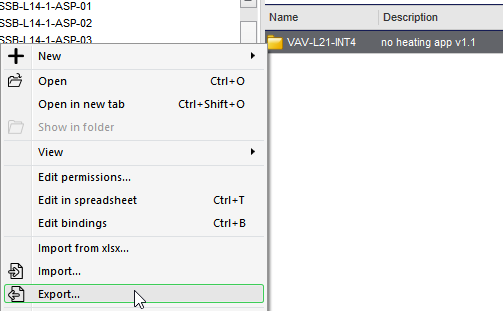
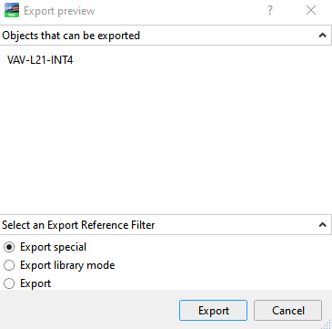
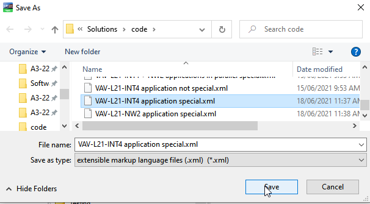
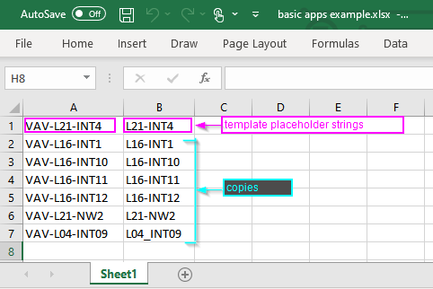
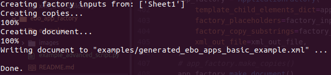
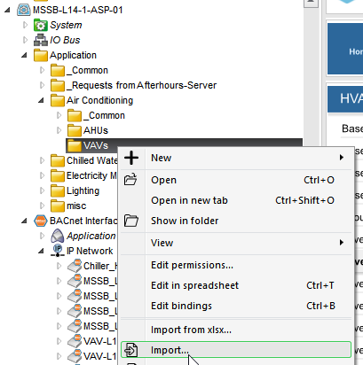
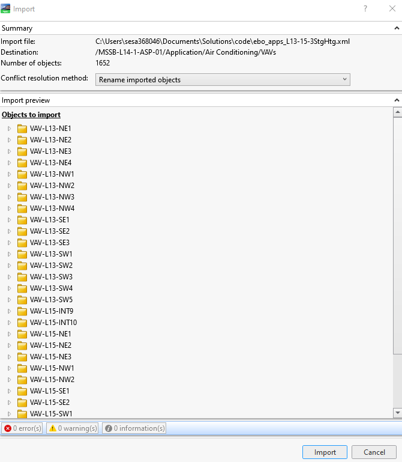
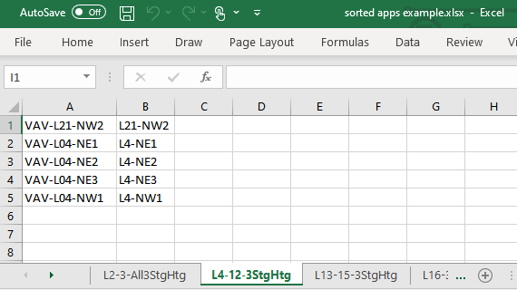
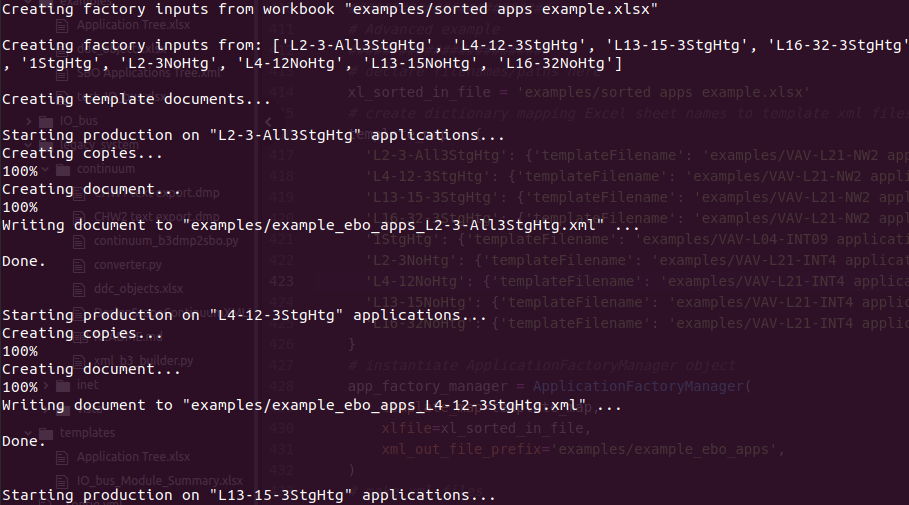
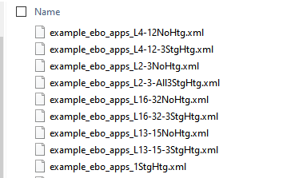

# ebo-app-factory

[](https://github.com/clivegross/ebo-app-factory/actions/workflows/build.yml)

---

## Table of Contents

- [Installation](#installation)
- [Overview](#overview)
- [Basic usage- template and spreadsheet](#basic-usage)
- [Advanced usage- templates and spreadsheet](#advanced-usage)
- [Building from scratch](#building-from-scratch-programmatically)
- [License](#license)

## Installation

```console
pip install git+https://github.com/clivegross/ebo-app-factory.git
```

## Overview

This tool allows an exported EBO application or objects to be used as a template for mass producing EBO applications or objects.

An EBO xml file or files are created for import into EBO. Each file contains 'copies' of the template xml objects. Each 'copy' and its bindings (if exported Special) are updated using a list of placeholders strings in the original template xml and a list of replacement strings for each copy. The list of placeholders and copies are to be used are stored in an Excel workbook. These strings could be anything unique to each instance, such as equipment names (eg "VAV-L21-INT4") or relative bind paths eg ("../../Servers/MSSB-L14-1-ASP-01/BACnet Interface/IP Network/VAV-L21-INT4").

All 'copies' of the template are written into an xml document or documents for importing into EBO. Each copy is presented in parallel in the root of the import file.

### Basic usage

The application requires two inputs in its most basic use case:

1. An EBO exported xml containing the objects to be used as a template making copies.
1. An Excel workbook with at least one sheet containing a list of replacement strings to replace placeholder strings within the template xml.

Instructions for basic use:

1. From EBO WorkStation, export the application, folder, or objects to be used as a template for copies to be made. The export can be either Standard or Special. Save the template xml file in the working directory of your EBO Application Factory program.

   

   

   

1. Identify strings within the template application that should be used as placeholders for replacement with new strings for each copy. These strings may be equipment names, relative bind paths or any text that is unique to each copy of the template. Each substring should be placed in a cell in the first row of the Excel sheet. In this example:
   - "VAV-L21-INT4" is the name of the equipment and it should be replaced with the equipment name for each copy. This string has been placed in cell A1.
   - The substring "L21-INT4" is common in all bindings and should be replaced with the equivalent substring for each copy's bindings. This string has been placed in cell B1.
1. Update the spreadsheet with the equivalent replacement strings for each copy. Each row in the sheet from row 2 onward should represent a different copy of the template application. The columns should line up with the placeholder strings from the template application in the first row. For example:

   - "VAV-L04-INT09" is placed in column A to line up with template placeholder string "VAV-L21-INT4".
   - "L04_INT09" is placed in column B to line up with template placeholder string "L21-INT4".

   

1. Save the Excel workbook in the working directory of your EBO Application Factory program.
1. In your EBO Application Factory program, import the EBO Application Factory module.
1. Set the filename and path of the input Excel spreadsheet and template xml file and the filename and path of the xml file to be created containing the application copies to be imported into EBO.
1. Instantitate the `ApplicationTemplate`, `FactoryInputsFromSpreadsheet` and `ApplicationFactory` objects, passing in the inputs as shown in the example below:

   ```python
   ########################
   # Basic example
   ########################
   from ebo_app_factory.xml_app_factory import ApplicationTemplate, FactoryInputsFromSpreadsheet, ApplicationFactory

   # declare filenames/paths here
   xl_in_file = 'examples/basic apps example.xlsx'
   xml_in_file = 'examples/VAV-L21-INT4 application special.xml'
   xml_out_file = 'examples/generated_ebo_apps_basic_example.xml'

   # instantiate AppTemplate object object
   app_template = ApplicationTemplate(xml_in_file, print_result=False)
   # instantiate FactoryInputsFromSpreadsheet object
   factory_inputs = FactoryInputsFromSpreadsheet(xl_in_file, print_result=False)
   # instantiate ApplicationFactory object and make xml
   app_factory = ApplicationFactory(
     template_child_elements_dict=app_template.template_child_elements_dict,
     factory_placeholders=factory_inputs.factory_placeholders,
     factory_copy_substrings=factory_inputs.factory_copy_substrings,
     xml_out_file=xml_out_file,
   )
   ```

1. Call the `make_document` method of your ApplicationFactory object to generate the xml file containing copies of your application, ready for import into EBO.

   ```python
   # create xml file
   app_factory.make_document()

   ```

   

1. Import the created xml file into EBO.

   
   

1. Inspect the imported copies for correct naming and bindings.

### Advanced usage

In situations where there are multiple groups of EBO applications that will either be imported into different locations in the System Tree or each use a different template xml file, or both, a helper class called `ApplicationFactoryManager` has been provided. A unique xml file is created for each sheet in the Excel workbook. In addition to the two Basic Usage requirements, an additional input is required:

- A dictionary of Excel workbook sheet names and corresponding EBO exported xml template files to use. I'm sure there is a more elegant way of mapping sheets to template xml files but that is a future problem. Example:

```python
template_map = {
  'L2-3-All3StgHtg': {'templateFilename': 'examples/VAV-L21-NW2 application special.xml'},
  'L4-12-3StgHtg': {'templateFilename': 'examples/VAV-L21-NW2 application special.xml'},
  'L13-15-3StgHtg': {'templateFilename': 'examples/VAV-L21-NW2 application special.xml'},
  'L16-27-3StgHtg': {'templateFilename': 'examples/VAV-L21-NW2 application special.xml'},
  '1StgHtg': {'templateFilename': 'examples/VAV-L04-INT09 application special.xml'},
  'L2-3NoHtg': {'templateFilename': 'examples/VAV-L21-INT4 application special.xml'},
  'L4-12NoHtg': {'templateFilename': 'examples/VAV-L21-INT4 application special.xml'},
  'L13-15NoHtg': {'templateFilename': 'examples/VAV-L21-INT4 application special.xml'},
  'L16-27NoHtg': {'templateFilename': 'examples/VAV-L21-INT4 application special.xml'},
}

```

Instructions for advanced use:

1. From EBO WorkStation, export the application, folder, or objects to be used as a template for each 'application group' of copies to be made. Unlike the basic usage, an unlimited number of template applications can be exported. Save the template xml files in the working directory of your EBO Application Factory program.

   

1. Create the Excel workbook as per the basic usage but split each 'application group' into a different sheet. For each sheet the same rule applies, first row contains template placeholder strings, subsequent rows represent replacement strings for each copy.
1. Save the Excel workbook in the working directory of your EBO Application Factory program.
1. In your EBO Application Factory program, import the EBO Application Factory Manager module.
1. Set the filename and path of the input Excel spreadsheet.
1. Create or import the dictionary mapping Excel workbook sheet names to template xml file paths containing the application copies to be imported into EBO.
1. Instantitate the ApplicationFactoryManager objects, passing in the inputs as shown in the example below. Include the file path/prefix for the application group xml files to be written to. The suffix of each file will be the Excel workbook sheet name.

   ```python
   ########################
   # Advanced example
   ########################
   from ebo_app_factory.xml_app_factory import ApplicationFactoryManager

   # declare filenames/paths here
   xl_sorted_in_file = 'examples/sorted apps example.xlsx'
   # create dictionary mapping Excel sheet names to template xml files
   template_map = {
     'L2-3-All3StgHtg': {'templateFilename': 'examples/VAV-L21-NW2 application special.xml'},
     'L4-12-3StgHtg': {'templateFilename': 'examples/VAV-L21-NW2 application special.xml'},
     'L13-15-3StgHtg': {'templateFilename': 'examples/VAV-L21-NW2 application special.xml'},
     'L16-32-3StgHtg': {'templateFilename': 'examples/VAV-L21-NW2 application special.xml'},
     '1StgHtg': {'templateFilename': 'examples/VAV-L04-INT09 application special.xml'},
     'L2-3NoHtg': {'templateFilename': 'examples/VAV-L21-INT4 application special.xml'},
     'L4-12NoHtg': {'templateFilename': 'examples/VAV-L21-INT4 application special.xml'},
     'L13-15NoHtg': {'templateFilename': 'examples/VAV-L21-INT4 application special.xml'},
     'L16-32NoHtg': {'templateFilename': 'examples/VAV-L21-INT4 application special.xml'},
   }
   # instantiate ApplicationFactoryManager object
   app_factory_manager = ApplicationFactoryManager(
     template_map=template_map,
     xlfile=xl_sorted_in_file,
     xml_out_file_prefix='examples/example_ebo_apps'
   )

   ```

1. Call the `make_documents` method of your ApplicationFactoryManager object to generate the xml file containing copies of your application, ready for import into EBO.

   ```python
   # create xml files
   app_factory_manager.make_documents()

   ```

   

   

1. As per Basic Usage, import the created xml files into EBO and inspect the imported copies for correct naming and bindings.

## Building from scratch programmatically

### EBOXMLBuilder Usage

The `EBOXMLBuilder` class provides a simple way to programmatically build EBO-compliant XML files for import.

#### Example

```python
from ebo_app_factory.ebo_xml_builder import EBOXMLBuilder
import xml.etree.ElementTree as ET

# Create a builder instance
builder = EBOXMLBuilder(ebo_version="6.0.4.90", server_full_path="/Server 1")

# Create a custom object (example: a device)
device = ET.Element("OI", {"NAME": "Test Device", "TYPE": "modbus.network.TCPDevice"})

# Add the device to the exported objects section
builder.add_to_exported_objects(device)

# Write the XML to a file
builder.write_xml("output.xml")

# Or get the pretty-printed XML as a string
xml_str = builder.to_pretty_xml()
print(xml_str)
```

You can also use `builder.append_child(parent, child)` to append XML elements.

---

### EBOModbusBuilder Usage

The `EBOModbusBuilder` class extends `EBOXMLBuilder` and provides convenient methods for building Modbus device and register group XML structures for EBO import.

#### Example

```python
from ebo_app_factory.modbus_builder import EBOModbusBuilder

# Create a builder instance
builder = EBOModbusBuilder(ebo_version="6.0.4.90", server_full_path="/Server 1")

# Create a Modbus device
device = builder.create_device(name="Fire Gateway 1", ip_address="192.168.168.69")

# Create a Modbus Register Group for loop devices
group1 = builder.create_modbus_register_group(
    name="Modbus Register Group Loop Devices", poll_interval=13000
)

# Create a holding register point and add to the group
point1 = builder.create_holding_register_point(
    name="L1 - D2 - Z5 - IRD-ICG-B04-SIC-05 COMMS CUPBOARD - OPT - ALARM",
    register_number=242,
    bit_mask=16,
    description="{{Description}}",
    note1="{{Note1}}",
    note2="{{Note2}}",
)
group1.append(point1)

# Create another group and point
group2 = builder.create_modbus_register_group(name="Modbus Register Group Loops")
point2 = builder.create_holding_register_point(
    name="LOOP L2 - N1 - OPEN CIRCUIT",
    register_number=152,
    bit_mask=1,
    description="{{Description}}",
    note1="{{Note1}}",
    note2="{{Note2}}",
)
group2.append(point2)

# Optionally, create a default digital coil point
point3 = builder.create_point("Some Default Digital Coil")

# Assemble the device structure
device.append(group1)
device.append(group2)
device.append(point3)

# Add the device to the exported objects section
builder.add_to_exported_objects(device)

# Write the XML to a file
builder.write_xml("modbus.xml")

# Or get the pretty-printed XML as a string
xml_str = builder.to_pretty_xml()
print(xml_str)
```

This will generate an EBO-compliant XML file with your Modbus device, points and holding register groups, ready for import into EBO.

### EBOScheduleBuilder Usage

The `EBOScheduleBuilder` class extends `EBOXMLBuilder` and provides methods for building EBO-compliant schedule XML structures, including multistate schedules and special events.

#### Example

```python
from ebo_app_factory.schedule_builder import EBOScheduleBuilder

# Create a builder instance
builder = EBOScheduleBuilder(ebo_version="6.0.4.90", server_full_path="/Server 1")

# Define time-value pairs for two special events
tvp_values_event_1 = [
    {"Hour": 6, "Minute": 13, "Value": 1},
    {"Hour": 16, "Minute": 30, "Value": 9},
]
tvp_values_event_2 = [
    {"Hour": 7, "Minute": 0, "Value": 2},
    {"Hour": 18, "Minute": 15, "Value": 3},
]

# Create two special events
event_1 = builder.create_schedule_special_event(event_name="05-01", day_of_month=1, month=5)
event_2 = builder.create_schedule_special_event(event_name="05-02", day_of_month=2, month=5)

# Add time-value pairs to the events
builder.add_integer_value_pairs_to_event(event_1, tvp_values_event_1)
builder.add_integer_value_pairs_to_event(event_2, tvp_values_event_2)

# Create a multistate schedule and add the special events
schedule = builder.create_multistate_schedule("Test Schedule", schedule_default=0)
builder.add_special_events_to_schedule(schedule, [event_1, event_2])

# Add the schedule to the exported objects section
builder.add_to_exported_objects(schedule)

# Write the XML to a file
builder.write_xml("schedule.xml")

# Or get the pretty-printed XML as a string
xml_str = builder.to_pretty_xml()
print(xml_str)
```

This will generate an EBO-compliant XML file with your schedule and special events, ready for import into EBO.

## Contributing

See [Contributing](CONTRIBUTING.md)

## License

`ebo-app-factory` is distributed under the terms of the [MIT](https://spdx.org/licenses/MIT.html) license.
